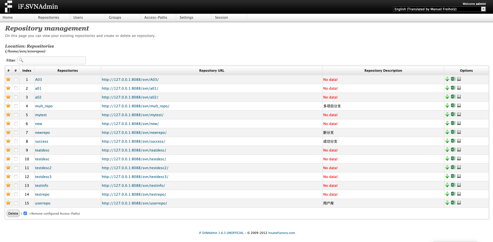
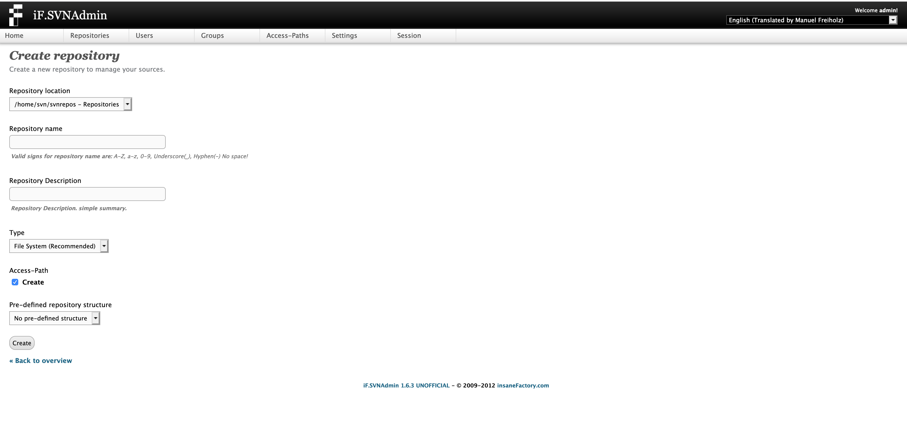
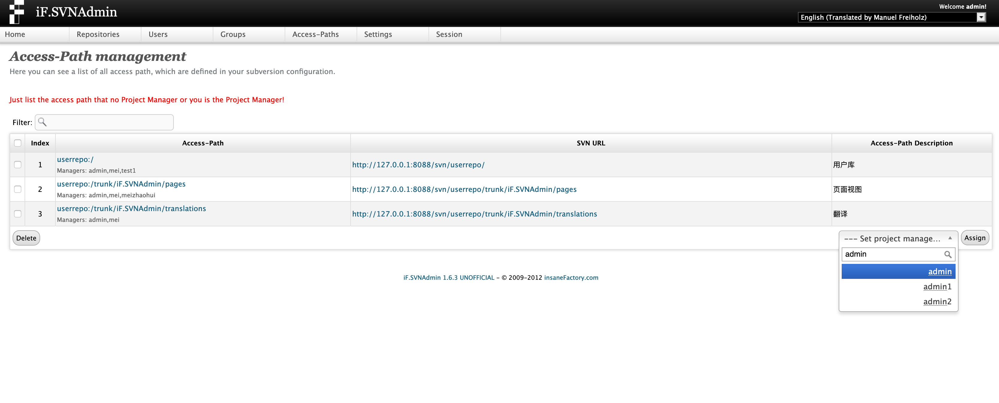
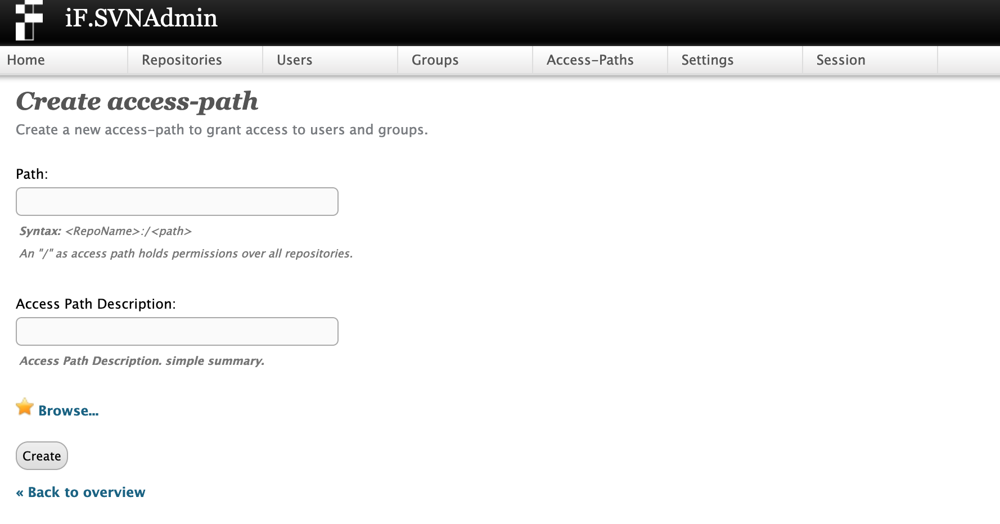

iF.SVNAdmin
===========
The iF.SVNAdmin application is a web based GUI to your Subversion authorization 
file. It is based on PHP 5.3 and requires a web server (Apache) to be installed. 
The application doesn’t need a database back end or anything similar, it 
completely based on the Subversion authorization- and user authentication file. 
(+Inludes LDAP support for users and groups)

Documentation
-------------
Documentation about installation and configuration can be found on the project homepage.
[http://svnadmin.insanefactory.com/](http://svnadmin.insanefactory.com/)

Function
-------------

we add the follow functions:

- add table index in most tables.
- add Repository URL to SVN WEB link.
- add repository description.
- add the function that to download the csv file that contain all the file path in the repository. 
- add the function that to download the csv file that contain the access path permissions in the repository.
- add search function in the drop-down box.

Display like this:

Who is responsible for this crap?
---------------------------------
Manuel Freiholz (<ifsvnadmin@insanefactory.com>), [insaneFactory.com](http://www.insanefactory.com/)

In case you feel happy with the application, got a lot of money to waste and don't know where to put it... you might consider to spend it on my Amazon wish list.

[Manuel's Amazon wish list](http://www.amazon.de/registry/wishlist/JPUP61UZKHQ0)
